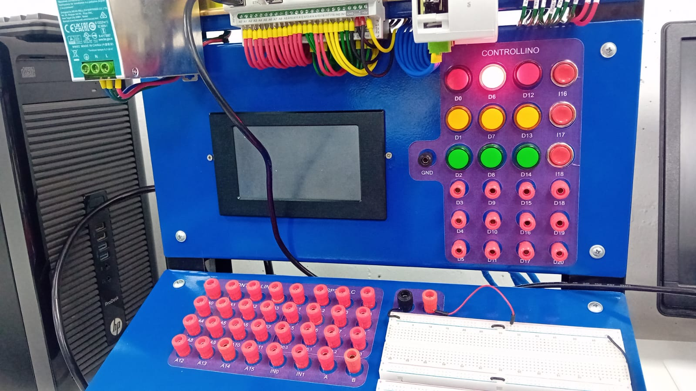

# 📘 Práctica 1: Manejo de Salidas Digitales con Controllino Mega

## 🎯 Objetivo
Encender secuencialmente LEDs utilizando las salidas digitales del Controllino Mega para familiarizarse con su uso.

## 📂 Archivos incluidos
- `Practica1.ino`: Código fuente para la secuencia de encendido.
- `Evidencias/`: Carpeta para fotos y videos del resultado.
- `Informe_Practica1.pdf`: [Documento explicativo en formato IEEE](/Informe_practicas.pdf).
  

## 🔍 Evidencia

A continuación se muestra una imagen de la secuencia de encendido de los LEDs:

## 🎥 Video de demostración

<video src="Evidencias/practica1.mp4" controls style="max-width: 100%; height: auto;">
  Tu navegador no soporta video HTML5.
</video>

## 🗒️ Descripción
En esta práctica se utiliza la librería `Controllino.h` para manipular salidas digitales con variables predefinidas. La secuencia de LEDs simula un control secuencial típico en automatización.

## 👤 Autor
Elizabeth Corte y Dayana Jara
