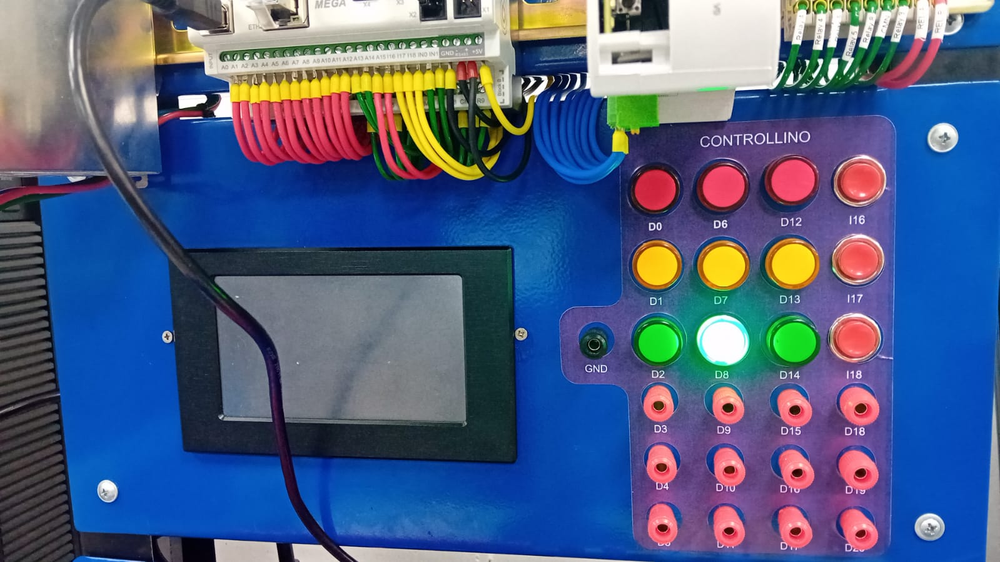
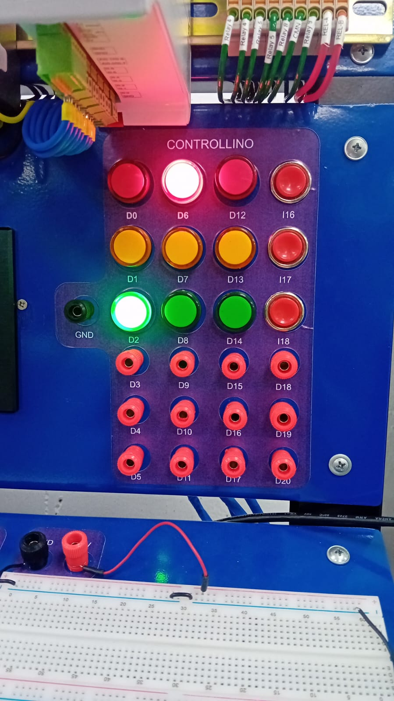
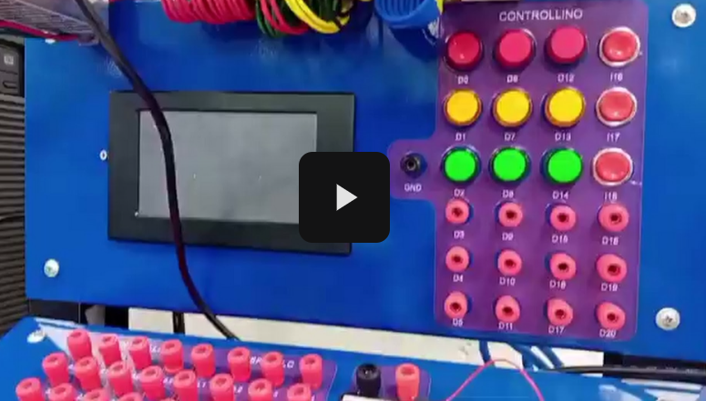
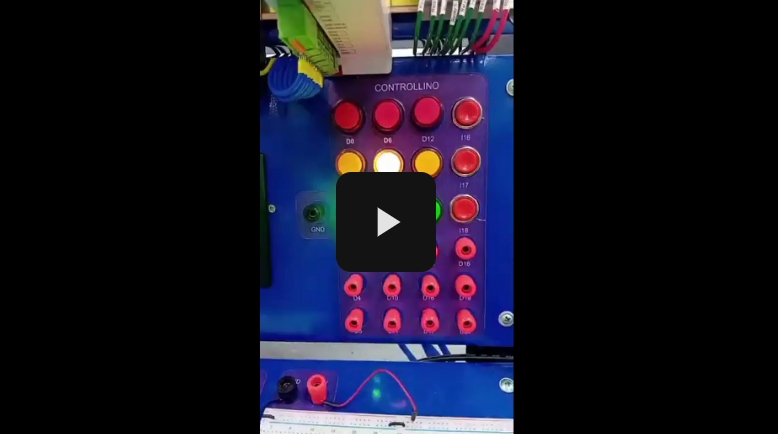

# 📗 Práctica 2: Control Básico y FSM

## 🎯 Objetivo
Controlar un LED mediante botones y diseñar una máquina de estados finita (FSM) para semáforos.

## 📂 Archivos incluidos
- `ParteA/`: Código y pruebas para encender y apagar un LED con botones.
- `ParteB/`: Implementación de la FSM para semáforos.
- `Diagrama_FSM.jpg`: Diagrama de estados.
- `Informe_Practica2.pdf`: [Documento explicativo en formato IEEE](/Informe_practicas.pdf).

## 🔍 Evidencia

A continuación se muestra una imagen del resultado de la ParteA:

A continuación se muestra una imagen del resultado de la ParteB:

## 🎥 Video de demostración

## Parte A

## Parte B

## 🗒️ Descripción
La práctica fortalece conocimientos de control digital y estructuras de programación usando Controllino Mega.

Para la parte A, el código implementa un sistema de control para una secuencia de 9 LEDs mediante una máquina de estados, utilizando un Controllino y tres botones. El programa permite tres modos de funcionamiento: secuencia normal (los LEDs se encienden de izquierda a derecha), secuencia inversa (de derecha a izquierda) y apagado total. Cada modo se activa al presionar un botón específico, y el cambio de LEDs se controla con temporización no bloqueante usando `millis()`, lo que permite actualizar los estados sin detener el programa. La lógica principal está organizada en una estructura `switch` que evalúa el estado actual (`APAGADO`, `SECUENCIA_NORMAL` o `SECUENCIA_INVERSA`) y ejecuta las funciones correspondientes para encender los LEDs en el orden definido o apagarlos. Además, se utilizan funciones auxiliares para manejar la secuencia y el apagado de los LEDs, asegurando un control claro y modular del sistema.

## 👤 Autor
Elizabeth Corte y Dayana Jara
