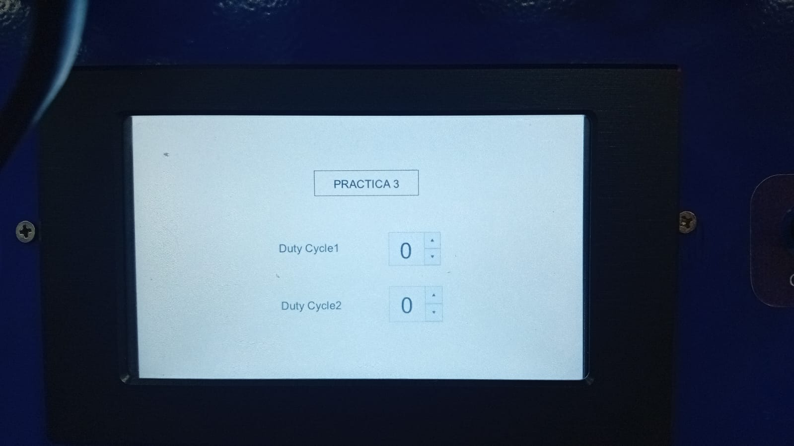
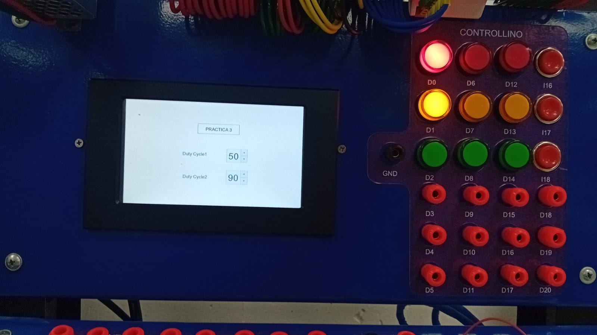
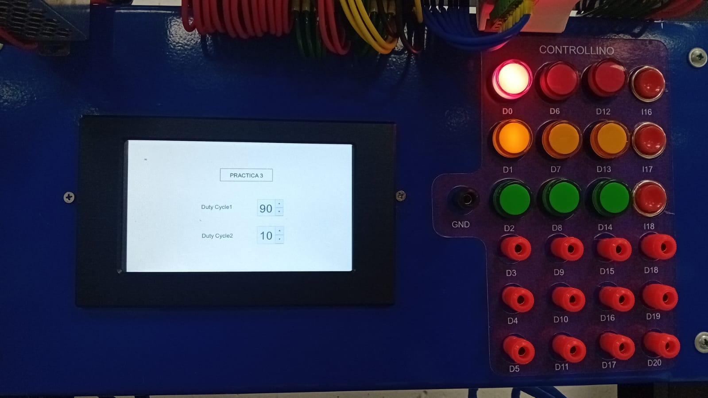
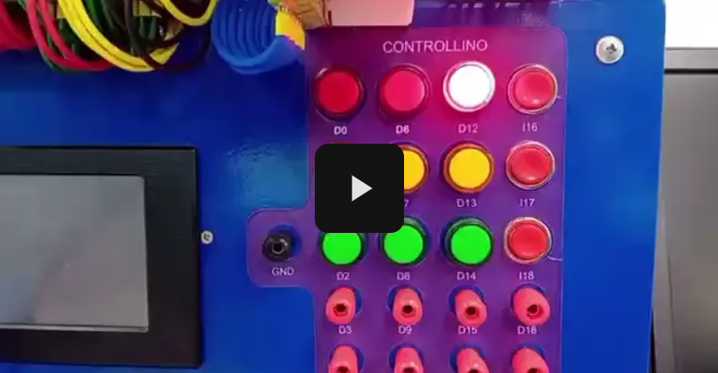

# 📙 Práctica 3: Interfaz Gráfica con HMI STONE

## 🎯 Objetivo
Diseñar y usar una interfaz gráfica en la pantalla HMI para controlar el brillo de un LED vía PWM.

## 📂 Archivos incluidos
- `Practica3.ino`: Código Arduino para recibir datos del HMI y generar PWM.
- `Proyecto_StoneDesigner/`: Archivos del proyecto diseñado en STONE Designer GUI.
- `Informe_Practica3.pdf`:[Documento explicativo en formato IEEE](/Informe_practicas).
- `Evidencias/`: Fotos y videos del funcionamiento.

## 🔍 Evidencia

A continuación se muestra imagenes del HMI final:

Tambien se muestra imagenes de diferentes niveles de ruido:

## 🎥 Video de demostración

## 🗒️ Descripción
Se implementa un SpinBox en la HMI para ajustar el ciclo de trabajo del PWM, permitiendo cambiar la intensidad del LED en tiempo real.

## 👤 Autor
Elizabeth Corte y Dayana Jara
