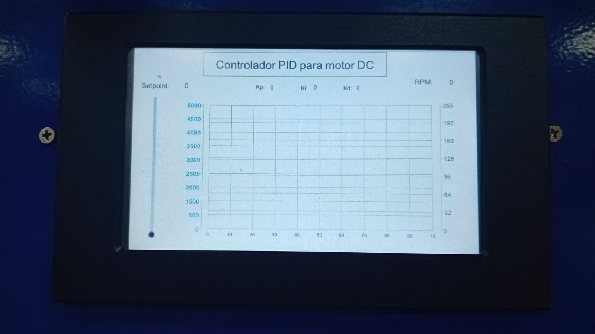
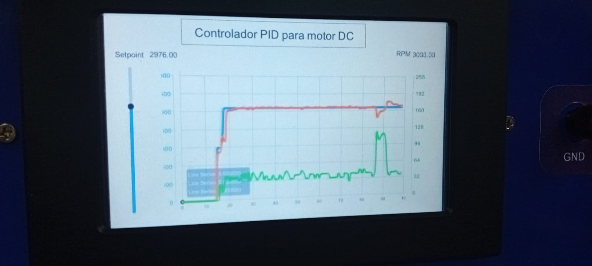
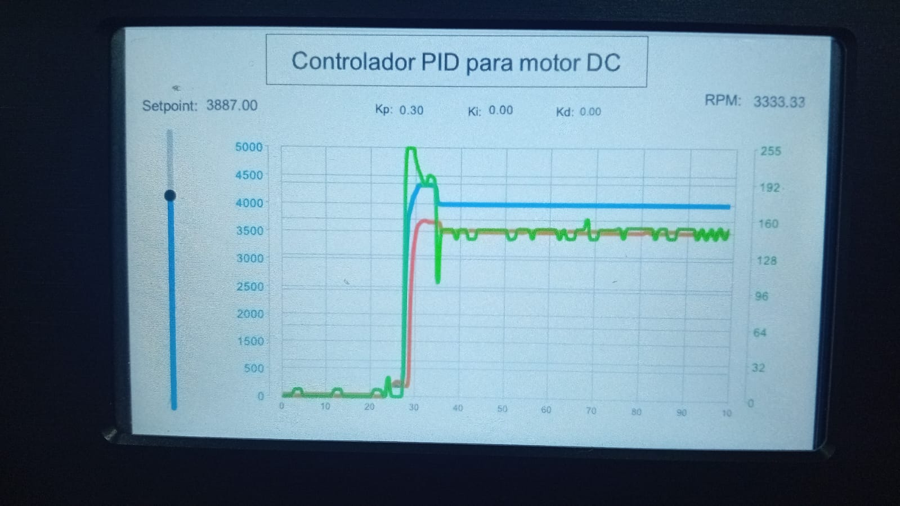

# 📕 Práctica 4: Adquisición de Datos y Control PID

## 🎯 Objetivo
Adquirir datos de un motor DC, mostrar gráficas en HMI y controlar su velocidad con un PID.

## 📂 Archivos incluidos
- `Practica4.ino`: Código base para adquisición de datos y control.
- `Proyecto_StoneDesigner/`: Proyecto de HMI para sliders, gráficas y labels.
- `Informe_Practica4.pdf`: [Documento explicativo en formato IEEE](/Informe_practicas).
- `Practica4_labview.vi`: Proyecto para adquisicion de datos para hallar la funcion de transferencia del motor.
- `Practica4_matlab.vi`: Codigo base para obtener la funcion de transferencia.
- `Evidencias/`: Fotos, videos y resultados experimentales.
- `Practica4.txt`: Datos adquiridos del motor.

## 🔍 Evidencia

Interfaz final:

A continuación se muestra una imagen que muestra como el controlador PID regula automáticamente la velocidad
del motor DC del EPC a un valor de referencia definido.

## 🎥 Video de demostración

## 🗒️ Descripción
Se implementa control PWM, conteo de pulsos mediante interrupciones, cálculo de RPM y un PID para regular la velocidad. Se visualizan datos en tiempo real en la HMI.

## 👤 Autor
Elizabeth Corte y Dayana Jara
