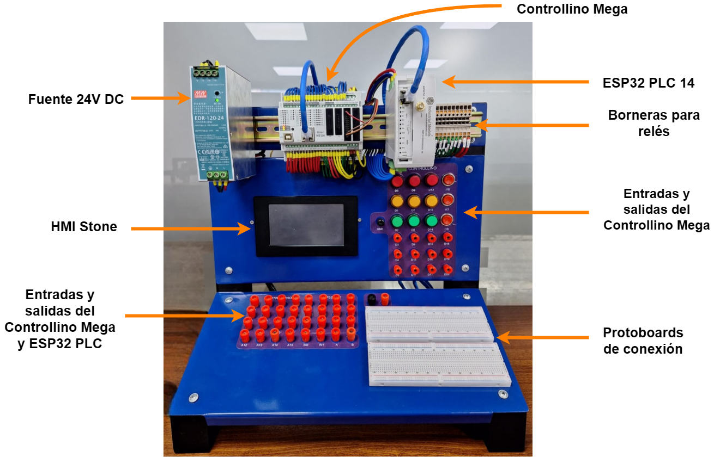

# 🛠️ Prácticas de Automatización y Control con Tableros Didácticos

Este repositorio contiene la documentación, códigos fuente y recursos relacionados con las prácticas realizadas utilizando los tableros didácticos basados en **Controllino Mega**, **ESP32 PLC 14** y la interfaz **HMI STONE**, siguiendo la guía oficial proporcionada por el Departamento de Ingeniería Eléctrica, Electrónica y Telecomunicaciones.




## 📚 **Contenido del repositorio**

Este repositorio está organizado de acuerdo con las prácticas detalladas en la guía:

- ✅ **Práctica 1:** Manejo de Salidas Digitales con Controllino Mega.
- ✅ **Práctica 2:** Control básico de salidas digitales y aplicación avanzada con Máquina de Estados Finita (FSM).
- ✅ **Práctica 3:** Diseño de interfaz gráfica para control de salidas con HMI STONE.
- ✅ **Práctica 4:** Adquisición de datos de motor, visualización gráfica y control de velocidad con controlador PID.

Cada práctica incluye:
- Descripción y objetivo.
- Códigos fuente comentados.
- Capturas de pantalla o videos de evidencia.
- Documentos en formato IEEE si aplica.
- Archivos de proyecto de HMI (STONE Designer GUI).

## 📂 **Estructura del repositorio**

```
Practicas-Tableros/
├── Practica1/
│   ├── Practica1.ino
│   ├── Evidencias/
│   └── README.md
├── Practica2/
│   ├── ParteA/
│   ├── ParteB/
│   ├── Diagrama_FSM.png
│   └── README.md
├── Practica3/
│   ├── Practica3.ino
│   ├── Proyecto_StoneDesigner/
│   ├── Evidencias/
│   └── README.md
├── Practica4/
│   ├── Practica4.ino
│   ├── Proyecto_StoneDesigner/
│   ├── Practica4_labview.vi
|   ├── Practica4_matlab.m
|   ├── Practica4.txt
│   ├── Evidencias/
│   └── README.md
├── Guia_de_uso_de_Tableros.pdf
├── Informe_practicas.pdf
└── README.md
```

## ⚙️ **Requisitos**

- Arduino IDE configurado para **Controllino Mega** y **ESP32 PLC 14**.
- Librerías necesarias:
  - [Controllino.h](https://www.controllino.com/board-library-setup-in-arduino-ide/)
  - [Procesar_HMI.h](/Practica3/reto/Procesar_HMI.h)
- Software **STONE Designer GUI** para diseñar interfaces gráficas en el HMI STONE.


## 📑 **Referencias**

- [Guía de uso de Tableros (PDF)](/Guía_de_uso_de_Tableros.pdf)
- [Controllino Official Website](https://www.controllino.com/)
- [STONE HMI Official Website](https://www.stoneitech.com/)

## ✏️ **Autor**

- **Nombre:** Elizabeth Corte y Dayana Jara
- **Institución:** Departamento de Ingeniería Eléctrica, Electrónica y Telecomunicaciones
- **Fecha:** Junio 2025


